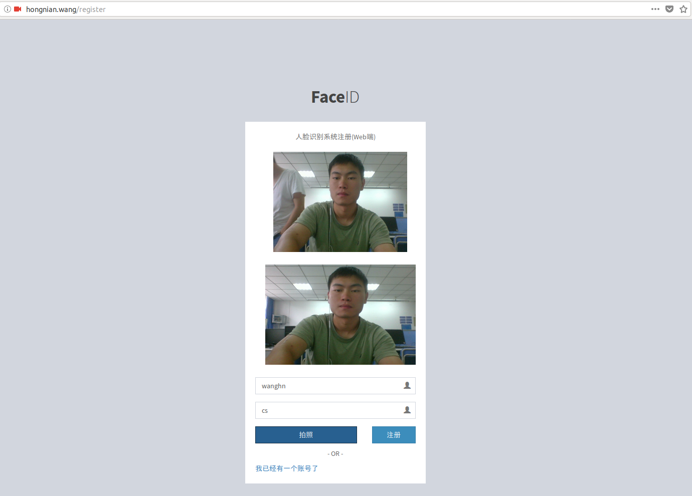
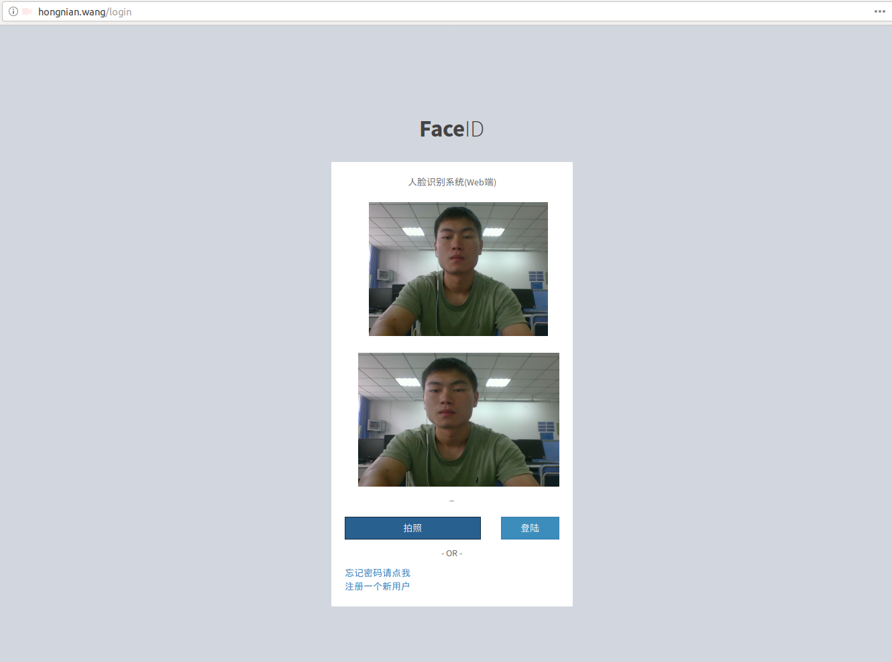
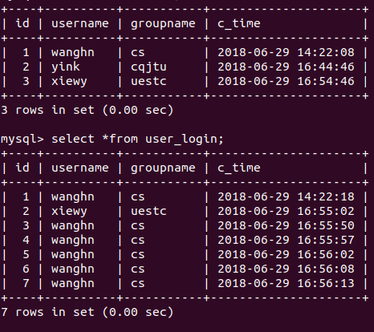

# python-web：face registration and login

Building a personal website, realized face registration and login.

This system uses Mysql as a database tool, developed using python3.6, connected to the database using the third-party package pymysql, the web framework used tornado5.0.

#### PATH setting

Place your own html file in the /templates, the css file in the /static/css, the image file in the /static/image, and the js file in the /static/js.
#### DATABASE setting

Just configure your own database and call pymysql.connect(), refer to the official documentation. The configuration dictionary format is as follows

```python
PY_MYSQL_CONN_DICT = {
     'host' : 'localhost',  # This database is in the same server as the web.
     'user' : 'user_name',
     'password' : 'password',
     'database' : 'db_name',
     'port' : port,
     'charset' : 'utf8'}
```

#### Face API  setting

Because this part is to call Baidu's API, you need to create a new AipFace, the code is as follows:
```python
from aip import AipFace

APP_ID = 'your APP ID'
API_KEY = 'your Api Key'
SECRET_KEY = 'your Secret Key'

client = AipFace(APP_ID, API_KEY, SECRET_KEY)
```
In the above code, the constant APP_ID is created in the Baidu cloud console. The constant API_KEY and SECRET_KEY are the strings assigned to the user after the application is created. They are used to identify the user and perform signature verification for the access. View in the list of apps in the service console

#### server

- os：CentOS 6 x64
- language：Python3.6
- database：Mysql-server 5.1.73
- First we need to install Mysql and Python3.6, then install tornado and pymysql. you can use `pip install {packagename}==version
`
- run  `python {filename.py}`. In order to keep running, you can use the screen command or the nohup command.


register



login


![login2(assets/login2.png)

database



